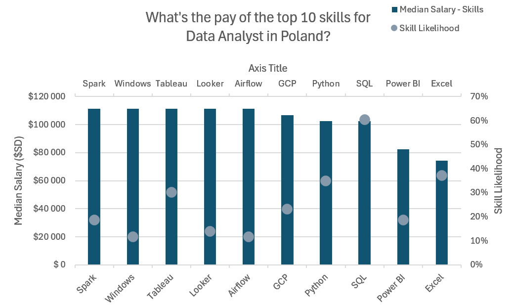

# 📊 IT Job Market Data Analysis (Excel Project)

## 📁 Introduction  
This project is an **Excel-based analysis** of the IT job market in Poland.  
It combines raw job posting data with **Power Query** and **Power Pivot** to clean, transform, and model the dataset, making it easier to uncover trends and insights.

## 🔍 Key Features
- **Data Cleaning & Transformation**  
  Used Power Query to structure, normalize, and combine multiple data sources.  

- **Data Modeling**  
  Leveraged Power Pivot to build relationships and create meaningful measures.  

**Charts & Visuals**  
  Created interactive charts that show trends such as:
1. **Skills vs. Salary Levels**  
     This chart explores the relationship between the number of skills required for a job and its median pay.  
     It reveals whether more listed skills translate into bigger salaries.
   
3. **Salary Benchmark: what are the rates in Poland in comparison to US countries and NON-US countries**  
     A comparison of median salaries for the same job titles across Poland, the United States, and the wider non-US market.
   
5. **Most In-Demand Skills for Data Analysts**  
     A visualization of the skills most frequently appearing in Data Analyst job postings.  
     It shows which tools and technologies are most valued by employers.
   
7. **Salary Outlook for Top 10 Data Analyst Skills in Poland**  
     This chart connects the top-requested Data Analyst skills with their corresponding salary levels.  
     It reveals which skills are linked to the biggest pay in the Polish market.

## Analysis
# 1. Skills Vs Pay

Looking at that chart “Do more skills get better pay?”, I have a few concise conclusions:

- There is a *positive correlation*: roles that require more skills tend to offer bigger salaries.

- Senior roles (e.g., Senior Data Analyst, Data Engineer) sit in the top-right corner, showing both higher pay and more skills requested.

- Entry-level or narrower roles (e.g., Cloud Engineer, Business Analyst) require fewer skills and fall into the lower salary range.

- Some specialized roles (Data Scientist, Machine Learning Engineer) show exceptions, with relatively high pay but not always the highest skill count.
# 2. Salary Comparison

Conclusions – Salary Benchmark

- Overall, Poland’s average median salary ($98,392) is lower than both the US ($118,940) and the global non-US benchmark ($111,175).

- The gap is most visible for highly specialized roles like Machine Learning Engineer and Senior Data Engineer, where US salaries are significantly higher.

- For some roles (e.g., Business Analyst, Data Analyst), Polish salaries are close to or slightly above non-US averages, but still below US levels.

- The difference shows that while Poland is competitive compared to other non-US countries in some IT roles, the US consistently offers higher pay across the board.
# 3. Top Skills

- The most valuable skill in Data Analyst roles is *SQL* which is present in over 60% of job postings.
- After SQL there is Excel and Python with similar percentage.
- The 3 least required skills are Looker, Windows and Airflow that have little over 10% requirement.
  
# 4. Data Analyst Skills and Pay in Poland

Conclusions – Data Analyst Skills and Pay in Poland

- High-paying skills include Spark, Windows, Tableau, Looker, and Airflow, all with salaries above $110,000.

- Widely requested skills like SQL and Excel appear very often in job postings, but their salaries are lower compared to more niche tools.

- Python balances both: it is in high demand and provides competitive salaries.

- Skills with lower likelihood but high salaries (e.g., Looker, Airflow) may represent specialized tools that few jobs require but pay well when they do.

- Power BI and Excel are common requirements but sit in the lower salary range, showing that popularity doesn’t always equal higher pay.
